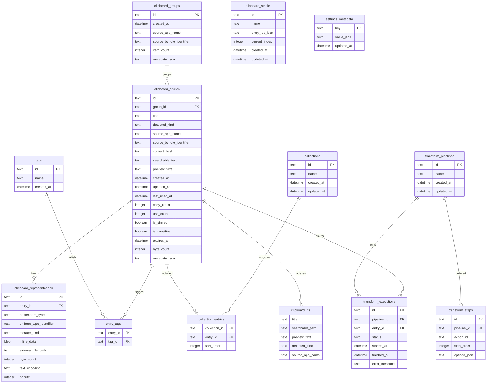

# DevClip 架构设计

## 架构摘要

DevClip 采用 SwiftPM 多 Target 结构：

- `DevClip`：macOS SwiftUI/AppKit 可执行 app，包含 `MenuBarExtra`、窗口和 AppKit Quick Panel 边界。
- `DevClipCore`：模型、协议、服务 actor、仓储边界、搜索、转换、安全检测和数据库适配边界。
- `DevClipCoreTests`：核心逻辑单元测试。所有系统服务通过协议注入 Mock。

系统 API 只允许出现在适配层：

- `SystemPasteboardClient` 封装 `NSPasteboard`。
- Quick Panel 与焦点恢复由 AppKit 控制器封装。
- 自动粘贴由 `PasteEngine` 通过可注入客户端封装 CGEvent 和辅助功能权限。
- 开机启动通过设置服务封装 `SMAppService`。
- Sparkle 2 仅保留 `UpdateCheckingClient` 接口，发布阶段再接入。

并发模型：

- SwiftUI View 和 ViewModel 运行在 MainActor。
- `ClipboardMonitor`、`TransformEngine`、`PasteEngine`、Blob Store 和 Repository 使用 actor 或后台任务。
- GRDB 使用 `DatabasePool`，数据库迁移、搜索和转换不在主线程运行。
- 跨并发边界的数据模型必须满足 `Sendable`。

## 技术栈

- Swift 6 language mode。
- SwiftUI 普通页面。
- AppKit Quick Panel、NSPanel、焦点恢复和菜单交互。
- Swift Package Manager。
- GRDB 管理 SQLite。
- SQLite FTS5，计划使用 trigram tokenizer。
- KeyboardShortcuts 管理用户可配置全局快捷键。
- NSPasteboard 通过 `PasteboardClient` 协议隔离。
- UTType 和原始 pasteboard type 保存多表示。
- CryptoKit AES-GCM 用于加密导出。

## 项目目录

```text
DevClip/
  Package.swift
  script/
    build_and_run.sh
  docs/
    PRODUCT_SPEC.md
    ARCHITECTURE.md
    ROADMAP.md
    SECURITY.md
    IMPLEMENTATION_STATUS.md
  Sources/
    DevClip/
      App/
      Views/
      Support/
    DevClipCore/
      BlobStore/
      Classification/
      Database/
      Models/
      Paste/
      Pasteboard/
      Repository/
      Search/
      Security/
      Support/
      Transforms/
      Updates/
  Tests/
    DevClipCoreTests/
```

## 核心模块

- Clipboard Capture：监听 `changeCount`，读取一次复制中的所有 item 和所有支持表示，生成 `ClipboardSnapshot`。
- Write Guard：使用内部 pasteboard type、transaction UUID、hash 和 changeCount 防止自写入循环。
- Repository：Phase 1 使用内存仓储，Phase 2 切到 GRDB/SQLite。
- Blob Store：图片和大二进制存放在 Application Support/DevClip/Blobs，数据库只保存路径和元数据。
- Content Classification：多个小 Detector 输出候选类型和置信度。
- Sensitive Detection：敏感内容独立检测，先于索引、日志和导出策略。
- Transform Engine：注册无状态转换 Action，支持单步、pipeline、取消和超时。
- Search：Query Parser 转为安全 FTS 查询和结构化过滤条件。
- Paste Engine：copyOnly 先实现，自动粘贴在获得用户授权后启用。

## 数据库 ER 设计



## 关键技术风险

- NSPasteboard 多 item 和多 representation 读取必须稳定，否则会丢失富文本、图片或文件列表。
- 自写入保护必须覆盖 transaction UUID、内部 type、hash 和 changeCount，否则重新复制历史会产生无限重复。
- SQLite FTS5 trigram tokenizer 可用性和查询转义必须验证，避免代码片段、路径、中文和短查询表现不稳定。
- 敏感检测存在误判和漏判风险，策略必须保守，日志和导出必须默认拒绝 secret。
- 自动粘贴依赖辅助功能权限、前台应用恢复和时序稳定，必须可降级为 copyOnly。
- Swift 严格并发下，AppKit、GRDB 和第三方库边界可能需要 `@MainActor`、actor 隔离或 `@preconcurrency` 包装。
- 图片缩略图、Hash 大文件和转换 pipeline 如果调度错误，会造成 Quick Panel 卡顿。
- Sparkle、签名、沙盒和开机启动在 SwiftPM app bundle 下需要发布阶段单独验证。

## 架构决定

- Phase 0 先建立 `DevClipCore` 库，避免把业务逻辑放进 SwiftUI View。
- 模型默认 `Sendable`，为 Swift 6 并发检查留出清晰边界。
- 系统服务先定义协议，真实实现按 Phase 推进。
- 数据库设计将大 Blob 放在文件系统，主 SQLite 只存索引、元数据和小 inline data。
- 转换 Action 设计为无状态协议，TransformEngine 负责注册、执行、超时和取消。
